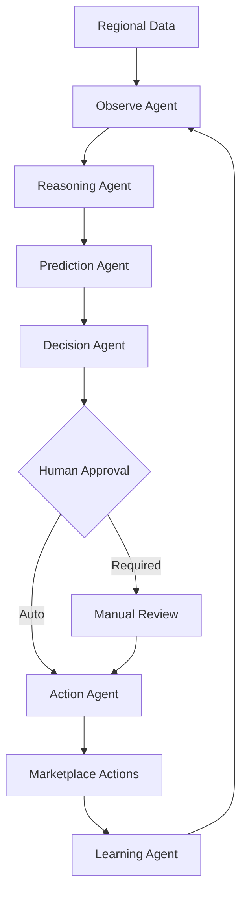

# VendSway

An Agentic AI-powered Regional Commerce Intelligence Platform that transforms regional demand signals into explainable decisions and controlled marketplace actions using a project-specific local LLM, RAG, tool calling, persistent agent memory, deterministic business intelligence, and human-in-the-loop autonomy.

---

## 🚀 What I Built

- Multi-agent ORPDAL architecture for autonomous commerce workflows
- Project-specific local LLM integration instead of external AI APIs
- RAG + controlled tool calling + persistent agent memory
- Deterministic business engine separated from probabilistic LLM reasoning
- Human-in-the-loop autonomy with approval controls
- Full-stack React + Node.js + PostgreSQL platform

---

## ⚡ Project Overview

```
Regional Signals → Observe → Reason → Predict → Decide → Human Approval → Act → Learn
```

VendSway observes regional commerce data, reasons about market conditions using both deterministic business logic and a local LLM, predicts future demand, makes actionable decisions, requires human approval for high-impact actions, executes validated marketplace operations, and learns from outcomes to improve future decisions.

---

## Problem

- Regional demand signals are fragmented across multiple data sources
- Marketplace catalogs have regional gaps that are difficult to identify systematically
- Qualified local sellers are difficult to discover and onboard at scale
- Analytics dashboards display insights but don't connect to actual marketplace actions
- Businesses need intelligence connected to action, not just data visualization

---

## Solution

VendSway closes the **Data → Insight → Decision → Action** gap through autonomous agent orchestration.



---

## Why This Is Actually Agentic

VendSway is not merely "AI with automation" — it implements true Agentic AI with goal-directed execution, multi-stage orchestration, state tracking, tool usage, decision-making, controlled action execution, human approval, and outcome feedback.

**Traditional AI:** Input → Model → Output

**VendSway:** Goal → Observe → Reason → Predict → Decide → Tool Use → Approval → Action → Outcome → Learn

---

## Agent Architecture

| Agent | Responsibility |
|-------|---------------|
| **Observe** | Collects regional commerce signals and database context |
| **Reasoning** | Analyzes observations and generates explainable reasoning |
| **Prediction** | Forecasts demand, inventory requirements, risks, and opportunities |
| **Decision** | Converts insights into actionable commerce decisions |
| **Action** | Executes validated marketplace operations |
| **Learning** | Tracks outcomes and feedback for system improvement |

---

## 🧠 Local Project-Specific LLM

VendSway uses a project-specific local LLM layer built around the Qwen2.5-0.5B-Instruct foundation model.

**Architecture:**
- Self-hosted local inference (no external API dependencies)
- Qwen2.5-0.5B-Instruct foundation (0.5B parameters, Apache 2.0 license)
- Domain-oriented architecture for regional commerce
- Structured JSON outputs for agent communication
- Reasoning and explanation generation
- Planning assistance for agent workflows
- Agent integration with graceful fallback
- FastAPI inference server
- LoRA/QLoRA-compatible training architecture for future domain adaptation

**Critical Separation:** The LLM is an intelligence layer, not the source of truth for business-critical operations. All business calculations, scoring, validation, and authorization remain in deterministic services.

---

## 📚 RAG Knowledge Layer

```
Query → Local Embedding → Semantic Retrieval → Relevant Knowledge → LLM Context → Structured Response
```

**Knowledge Categories:** Regional information, festivals, textiles, GI products, commerce knowledge, catalog information, seller information.

---

## 🔧 Tool-Calling System

Agents do not directly modify the database or perform unrestricted operations.

```
Agent → Tool Selection → Schema Validation → Authorization → Execution → Audit Log → Result
```

This is one of the project's strongest engineering points — controlled tool execution with validation, authorization, and audit logging.

---

## 🧠 Agent Memory

Persistent database-backed agent memory including conversation state, agent memory, tool-call history, human feedback, knowledge documents/chunks, and execution metadata.

---

## 🔐 Controlled Autonomy

| Level | Behavior |
|-------|----------|
| **recommend** | Agent produces recommendations but does not execute |
| **require_approval** | Agent prepares actions and waits for human approval |
| **auto_execute** | Agent may execute permitted low-risk actions automatically |

High-impact operations remain protected by approval and authorization — critical for enterprise AI deployment.

---

## Deterministic vs LLM Responsibilities

| Layer | Responsibility |
|-------|---------------|
| **LLM** | Reasoning, explanation, planning, language, structured generation |
| **RAG** | Knowledge grounding and context retrieval |
| **Tools** | Controlled operations with validation |
| **Deterministic Engine** | Business rules, scoring, calculations, validation, authorization |
| **Agents** | Orchestration and goal-directed execution |

Business calculations, scoring, authorization, validation, financial logic, and database integrity remain deterministic — an intentional architecture decision ensuring reliability.

---

## Full-Stack Architecture

```
React/Vite → Node/Express API → Agent Orchestrator → Agents → LLM + RAG + Tools + Memory → Deterministic Commerce Engine → PostgreSQL/Prisma
```

---

## Features

| Feature | Value |
|---------|-------|
| Agentic ORPDAL | Autonomous reasoning lifecycle |
| Local LLM | Domain-specific intelligence |
| RAG | Knowledge grounding |
| Tool Registry | Controlled actions |
| Agent Memory | Persistent context |
| Human-in-the-loop | Safe autonomy |
| Commerce Intelligence | Demand and catalog analysis |
| Seller Intelligence | Regional opportunities |
| Command Center | Agent monitoring |
| Auditability | Execution tracking |

---
## Key Highlights

- Designed multi-agent orchestration rather than single AI API calls
- Built local/self-hosted LLM integration layer
- Separated probabilistic LLM reasoning from deterministic business logic
- Implemented RAG for domain knowledge grounding
- Designed controlled tool execution with validation
- Added persistent agent memory with database backing
- Implemented human-in-the-loop autonomy controls
- Built complete frontend/backend/API/database integration
- Added auditability and execution tracking
- Designed feedback-driven improvement architecture

---

## Tech Stack

**Frontend:** React 18, TypeScript, Vite, React Router, TanStack Query, Zustand, TailwindCSS

**Backend:** Node.js 18, Express 4.18, TypeScript 5.0, Prisma 5.0, PostgreSQL 15

**Database:** PostgreSQL with Prisma ORM

**Agentic AI:** ORPDAL agent lifecycle, AgentOrchestrator, state tracking, tool usage

**LLM:** Qwen2.5-0.5B-Instruct foundation, FastAPI inference server, LoRA/QLoRA-compatible pipeline

**RAG:** sentence-transformers, local embeddings, semantic retrieval

**Security:** JWT authentication, RBAC, protected APIs, input validation, controlled tool execution

---

## Project Structure

```
VendSway/
├── backend/
│   ├── src/
│   │   ├── services/aiEngine/
│   │   │   ├── AgentOrchestrator.ts
│   │   │   ├── ObserveAgent.ts
│   │   │   ├── ReasoningAgent.ts
│   │   │   ├── PredictionAgent.ts
│   │   │   ├── DecisionAgent.ts
│   │   │   ├── ActionAgent.ts
│   │   │   └── LearningAgent.ts
│   │   ├── services/
│   │   │   ├── LLMService.ts
│   │   │   └── LLMIntegrationService.ts
│   │   └── controllers/
│   ├── prisma/schema.prisma
│   └── package.json
├── frontend/
│   ├── src/pages/admin/AICommandCenter.tsx
│   └── package.json
├── ai/
│   ├── inference/server.py
│   ├── rag/retrieval.py
│   ├── tools/tool_registry.py
│   └── requirements.txt
└── README.md
```

---

## Quick Start

### Application Setup

```bash
# Backend
cd backend
npm install
cp .env.example .env
npx prisma generate
npx prisma migrate dev
npm run dev

# Frontend (new terminal)
cd frontend
npm install
npm run dev
```

### AI Service Setup (Optional)

```bash
cd ai
pip install -r requirements.txt
python inference/server.py
```

---


## Why This Project Matters

This project demonstrates the ability to combine AI, Agentic Systems, LLMs, RAG, Backend Engineering, Database Design, Security, Human-in-the-loop Automation, and Frontend Engineering into a cohesive production-style architecture.

---

## Documentation

- [AI Setup Guide](AI_SETUP.md) - Practical setup of local AI service
- [LLM Implementation Summary](LLM_IMPLEMENTATION_SUMMARY.md) - Detailed technical architecture
- [Backend Documentation](backend/README.md) - Backend developer documentation
- [AI Layer Documentation](ai/README.md) - AI-layer developer documentation